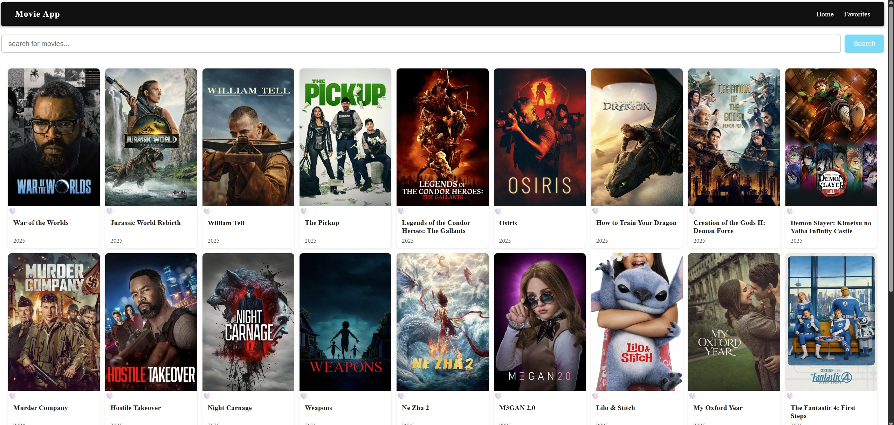

# MovieMate

MovieMate is a movie app built with React, designed as a learning project to explore React fundamentals, working with APIs, and JavaScript. The app allows users to browse movies, view details, and manage a list of favorites.

App is deployed and available for anyone to test. You can try it here: https://leafy-otter-44c2ee.netlify.app/

## Features
- Browse a list of movies fetched from an external API
- View movie details in a card layout
- Add or remove movies from your favorites
- Responsive navigation bar
- Clean and modern UI with custom CSS

## Technologies Used
- [React](https://react.dev/)
- [Vite](https://vitejs.dev/) for fast development
- JavaScript (ES6+)
- Custom CSS for styling


## Getting Started

1. **Install dependencies**
   ```bash
   npm install
   ```
2. **Start the development server**
   ```bash
   npm run dev
   ```

## Learning Goals
- Practice building React components and using hooks
- Work with React Context for state management
- Fetch and display data from an external API
- Apply custom CSS for layout and design


## Credits
- Movie data provided by an external API (see `src/services/api.js`)


## App Screenshot


